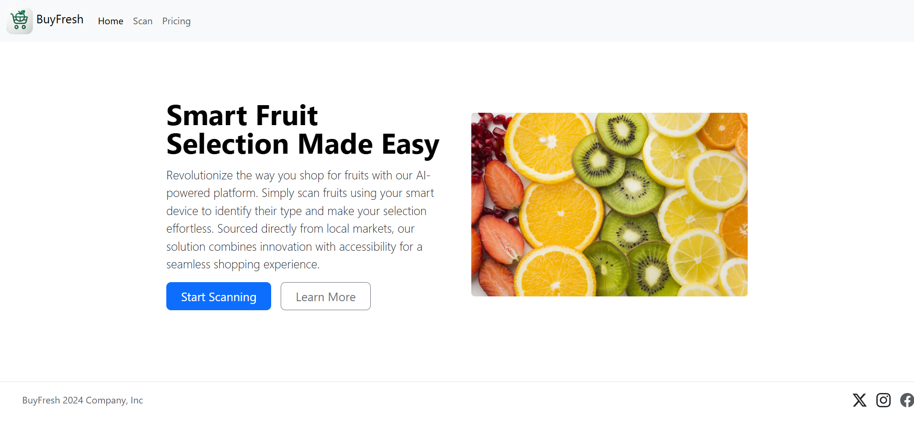

# Smart Fruit Shopping with BuyFresh

## Overview
A web application for smart fruit shopping, using AI to identify fruits via camera scanning. Built with Bootstrap for a responsive UI, JavaScript for client-side logic, and a Flask backend with YOLOv8 for fruit detection. Users can scan fruits using a mobile camera stream, add them to a cart, and view billing details.

## Screenshots

**Homepage**: Introduction to BuyFresh  


**Scanning Page**: Interface for scanning fruits  


**Scanning with Fruits**: Fruits detected during scanning  


**Billing Page**: Cart summary with total cost  


**Cart Update**: Dropdown showing updated cart contents  


## Features
- **AI Fruit Scanning**: Identifies fruits using YOLOv8 from a live camera stream.
- **Cart Management**: Add scanned fruits to a cart, view in a dropdown, and proceed to billing.
- **Responsive Design**: Mobile-friendly UI with Bootstrap.
- **Billing Summary**: Displays cart items, quantities, and total cost.
- **Available Items List**: Shows fruits with prices and images.

## Tech Stack
- HTML, CSS, JavaScript
- Bootstrap 5.3.3 for styling
- Flask for backend
- YOLOv8 for fruit detection
- OpenCV, NumPy, Pillow for image processing
- LocalStorage for cart persistence
- [RemoteCam](https://github.com/Ruddle/RemoteCam) for mobile camera streaming

## Prerequisites
- Python 3.8+
- Node.js (optional, for local server like `http-server`)
- YOLOv8 model (`yolov8n-seg.pt`)
- Mobile device with [RemoteCam app](https://github.com/Ruddle/RemoteCam#download) for camera streaming
- Chrome browser with [Allow CORS: Access-Control-Allow-Origin extension](https://chromewebstore.google.com/detail/allow-cors-access-control/lhobafahddgcelffkeicbaginigeejlf?hl=en)
- Modern web browser (Chrome recommended due to CORS requirements)

## Installation
1. Clone repo:
   ```bash
   git clone [<repository-url>](https://github.com/SniperWiper/BuyFresh) && cd buyfresh
   ```
2. Install Python dependencies:
   ```bash
   pip install flask opencv-python numpy ultralytics pillow
   ```
3. Download YOLOv8 model: Place `yolov8n-seg.pt` in the project directory.
4. Set up camera stream:
   - Install the [RemoteCam app](https://github.com/Ruddle/RemoteCam#download) on your mobile device.
   - Start the RemoteCam app to generate a stream URL (e.g., `http://<your-device-ip>:8080/cam.mjpeg`).
   - Update the stream URL in `script.js` (replace `http://192.168.191.253:8080/cam.mjpeg`) with the URL provided by RemoteCam. Note: The URL changes each time the app starts.
5. Install CORS extension:
   - Add the [Allow CORS: Access-Control-Allow-Origin](https://chromewebstore.google.com/detail/allow-cors-access-control/lhobafahddgcelffkeicbaginigeejlf?hl=en) Chrome extension to bypass CORS issues when accessing the live stream.
6. Run Flask backend:
   ```bash
   python server.py
   ```
7. Serve frontend (e.g., using `http-server`):
   ```bash
   npm install -g http-server
   http-server .
   ```
8. Visit: `http://localhost:8080` (or your server port)

## Structure
```
├── images/              # Fruit images, logo, screenshots
├── index.html           # Homepage
├── scanv1.html          # Scanning page
├── billing.html         # Billing page
├── script.js            # Client-side logic
├── server.py            # Flask backend
├── styles1.css          # Custom styles (referenced)
└── README.md
```

## Usage
1. **Homepage** (`index.html`): View BuyFresh intro and navigate to scanning.
2. **Scanning Page** (`scanv1.html`):
   - View available fruits.
   - Start the RemoteCam app on your mobile device and note the stream URL.
   - Update `script.js` with the current stream URL.
   - Click "Start Camera" to access the live stream.
   - Click "Scan" to capture and identify fruits.
   - Add detected fruits to cart via the navbar cart icon.
   - Click "Billing" to view cart summary.
3. **Billing Page** (`billing.html`): Displays cart items, quantities, and total cost.


## Endpoints
- **GET /**: Homepage (`index.html`)
- **GET /scanv1.html**: Scanning page
- **GET /billing.html**: Billing page
- **POST /process_image**: Backend endpoint for fruit detection (returns base64 image and detections)

## Notes
- **Camera Stream**: The RemoteCam app generates a new stream URL each time it starts. Update `script.js` accordingly.
- **CORS Issue**: The live stream from RemoteCam triggers CORS restrictions. Use the [Allow CORS Chrome extension](https://chromewebstore.google.com/detail/allow-cors-access-control/lhobafahddgcelffkeicbaginigeejlf?hl=en) to bypass this during development.
- **YOLOv8 Model**: Must be trained for fruit detection; fine-tune with a custom dataset if needed.
- **Cart Data**: Stored in `localStorage` and persists until cleared.
- **Unknown Items**: Detected fruits not in the available items list trigger an alert and are not added to the cart.
- **Flask Server**: Runs in debug mode; use a production server (e.g., Gunicorn) for deployment.

## Contributing
Fork the repo, create a branch, commit changes, and submit a pull request.
